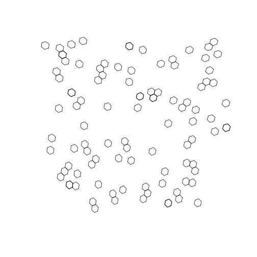
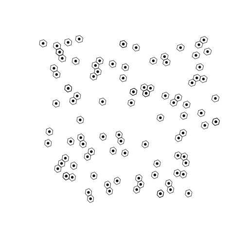

<!-- README.md is generated from README.Rmd. Please edit that file -->


# h3o

<!-- badges: start -->
[](https://github.com/JosiahParry/h3o/actions/workflows/R-CMD-check.yaml)
<!-- badges: end -->

h3o is a system-dependency free package to interact with the H3 Geospatial Indexing system by Uber. h3o utilizes the Rust library h3o with is a pure rust implementation of H3 and does not link or use Uber's H3 C library. h3o R interface is powered by [extendr](https://extendr.github.io/) and should be able to compile on any machine. 

## Installation

You can install the development version of h3o from [GitHub](https://github.com/) with:

``` r
# install.packages("remotes")
remotes::install_github("JosiahParry/h3o")
```

## Example

To illustrate the basic usage, we can first create an sf object of random points. 


``` r
pnts <- tibble::tibble(
  x = runif(100, -5, 10),
  y = runif(100, 40, 50)
) |> 
  sf::st_as_sf(
    coords = c("x", "y"), 
    crs = 4326
  )

```

h3o utilizes vctrs to create H3 class vectors so that they can work seemlessly within
a tidyverse workflow. 

h3o is intended to work with the sf package for geometric operations. 
H3 vectors can be created from `POINT` geometry columns (`sfc` objects).


``` r
library(h3o)

pnts |> 
  dplyr::mutate(h3 = h3_from_points(geometry, 5))
#> Simple feature collection with 100 features and 1 field
#> Geometry type: POINT
#> Dimension:     XY
#> Bounding box:  xmin: -4.919497 ymin: 40.25333 xmax: 9.98528 ymax: 49.9593
#> Geodetic CRS:  WGS 84
#> # A tibble: 100 × 2
#>                 geometry              h3
#>  *           <POINT [°]>            <H3>
#>  1   (2.785472 46.45577) 851f94cffffffff
#>  2   (5.259132 44.97223) 851f930ffffffff
#>  3   (8.734851 48.01969) 851f810ffffffff
#>  4  (-3.751716 49.25705) 85187193fffffff
#>  5   (9.780378 44.62055) 851ea6cbfffffff
#>  6    (7.87759 47.21568) 851f8303fffffff
#>  7   (6.871837 42.57346) 851eb6dbfffffff
#>  8   (4.450498 46.81359) 851f951bfffffff
#>  9 (0.01801486 43.70956) 8539668bfffffff
#> 10    (8.864163 44.3646) 851f9b0bfffffff
#> # ℹ 90 more rows
```
Additionally, H3 vectors also have an `st_as_sfc()` method which lets us convert vectors of H3 cell indexes into `POLYGON`s. 


``` r
h3_cells <- pnts |> 
  dplyr::mutate(
    h3 = h3_from_points(geometry, 4),
    # replace geometry
    geometry = sf::st_as_sfc(h3)
    )

# plot the hexagons
plot(sf::st_geometry(h3_cells))
```

<div class="figure">

<p class="caption">plot of chunk unnamed-chunk-3</p>
</div>

H3 cell centroids can be returned using `h3_to_points()`. If `sf` is avilable the results will
be returned as an `sfc` (sf column) object. Otherwise it will return a list of `sfg` (sf geometries). 


``` r
# fetch h3 column
h3s <- h3_cells$h3

# get there centers
h3_centers <- h3_to_points(h3s) 

# plot the hexagons with the centers
plot(sf::st_geometry(h3_cells))
plot(h3_centers, pch = 16, add = TRUE, col = "black")
```

<div class="figure">

<p class="caption">plot of chunk unnamed-chunk-4</p>
</div>


## sf compatibility

h3o was designed with sf in mind. H3 is a geospatial indexing system so it is important to be able to go back and from from H3 and sf objects. H3 object can be created from sfc objects and vice versa.sfc objects can also be created using the `sf::sf_as_sfc()` method for `H3` or `H3Edge` vectors.

`H3Edge` vectors represent the boundaries of H3 cells. They can be created with `h3_edges()`, `h3_shared_edge_pairwise()`, and `h3_shared_edge_sparse()`.


``` r
cell_edges <- h3_edges(h3s[1:3])
cell_edges
#> [[1]]
#> <H3Edge[6]>
#> [1] 1141f94dffffffff 1241f94dffffffff 1341f94dffffffff 1441f94dffffffff
#> [5] 1541f94dffffffff 1641f94dffffffff
#> 
#> [[2]]
#> <H3Edge[6]>
#> [1] 1141f931ffffffff 1241f931ffffffff 1341f931ffffffff 1441f931ffffffff
#> [5] 1541f931ffffffff 1641f931ffffffff
#> 
#> [[3]]
#> <H3Edge[6]>
#> [1] 1141f811ffffffff 1241f811ffffffff 1341f811ffffffff 1441f811ffffffff
#> [5] 1541f811ffffffff 1641f811ffffffff
```

We've created a list of each cell's edges. We can flatten them using `flatten_edges()`.


``` r
cell_edges <- flatten_edges(cell_edges)
cell_edges
#> <H3Edge[18]>
#>  [1] 1141f94dffffffff 1241f94dffffffff 1341f94dffffffff 1441f94dffffffff
#>  [5] 1541f94dffffffff 1641f94dffffffff 1141f931ffffffff 1241f931ffffffff
#>  [9] 1341f931ffffffff 1441f931ffffffff 1541f931ffffffff 1641f931ffffffff
#> [13] 1141f811ffffffff 1241f811ffffffff 1341f811ffffffff 1441f811ffffffff
#> [17] 1541f811ffffffff 1641f811ffffffff
```

These can be cast to sfc objects using its `st_as_sfc()` method.


``` r
sf::st_as_sfc(cell_edges)
#> Geometry set for 18 features 
#> Geometry type: LINESTRING
#> Dimension:     XY
#> Bounding box:  xmin: 2.395949 ymin: 44.79977 xmax: 8.827172 ymax: 48.382
#> Geodetic CRS:  WGS 84
#> First 5 geometries:
#> LINESTRING (2.948007 46.49839, 3.012846 46.72299)
#> LINESTRING (2.395949 46.5394, 2.63995 46.40685)
#> LINESTRING (2.63995 46.40685, 2.948007 46.49839)
#> LINESTRING (2.767743 46.85578, 2.458902 46.76373)
#> LINESTRING (3.012846 46.72299, 2.767743 46.85578)
```

Additionally, you can get the vertexes of H3 cell indexes using `h3_to_vertexes()` which returns an `sfc_MULTIPOINT`.


``` r
h3_to_vertexes(h3s)
#> Geometry set for 100 features 
#> Geometry type: MULTIPOINT
#> Dimension:     XY
#> Bounding box:  xmin: -5.510812 ymin: 39.78466 xmax: 10.22827 ymax: 50.12141
#> Geodetic CRS:  WGS 84
#> First 5 geometries:
#> MULTIPOINT ((2.458902 46.76373), (2.395949 46.5...
#> MULTIPOINT ((4.818449 45.17055), (4.748771 44.9...
#> MULTIPOINT ((8.243388 48.3043), (8.158854 48.08...
#> MULTIPOINT ((-3.697215 49.31703), (-4.01933 49....
#> MULTIPOINT ((9.666362 44.93792), (9.580722 44.7...
```


## Bench marks: 

Since h3o is written in Rust, it is very fast. 

Creating polygons 


``` r
h3_strs <- as.character(h3s)
bench::mark(
  h3o = sf::st_as_sfc(h3s),
  h3jsr = h3jsr::cell_to_polygon(h3_strs)
)
#> # A tibble: 2 × 6
#>   expression      min   median `itr/sec` mem_alloc `gc/sec`
#>   <bch:expr> <bch:tm> <bch:tm>     <dbl> <bch:byt>    <dbl>
#> 1 h3o         415.9µs 466.91µs     1985.    9.85KB     0   
#> 2 h3jsr        7.39ms   8.16ms      118.   77.18KB     4.36
```

Converting polygons to H3 cells: 


``` r
nc <- sf::st_read(system.file("gpkg/nc.gpkg", package = "sf"), quiet = TRUE) |> 
  sf::st_transform(4326) |> 
  sf::st_geometry()

bench::mark(
  h3o = sfc_to_cells(nc, 5, "centroid"),
  h3jsr = h3jsr::polygon_to_cells(nc, 5),
  check = FALSE
)
#> # A tibble: 2 × 6
#>   expression      min   median `itr/sec` mem_alloc `gc/sec`
#>   <bch:expr> <bch:tm> <bch:tm>     <dbl> <bch:byt>    <dbl>
#> 1 h3o          4.14ms   4.63ms     214.        6KB        0
#> 2 h3jsr       28.13ms  29.28ms      33.9    18.6KB        0
```

Converting points to cells


``` r
bench::mark(
  h3o = h3_from_points(pnts$geometry, 3),
  h3jsr = h3jsr::point_to_cell(pnts$geometry, 3),
  check = FALSE
)
#> # A tibble: 2 × 6
#>   expression      min   median `itr/sec` mem_alloc `gc/sec`
#>   <bch:expr> <bch:tm> <bch:tm>     <dbl> <bch:byt>    <dbl>
#> 1 h3o        140.14µs 168.88µs     4951.      848B     2.20
#> 2 h3jsr        2.04ms   2.42ms      400.    55.6KB     2.27
```

Retrieve edges


``` r
bench::mark(
  h3o = h3_edges(h3s),
  h3jsr = h3jsr::get_udedges(h3_strs),
  check = FALSE
)
#> # A tibble: 2 × 6
#>   expression      min   median `itr/sec` mem_alloc `gc/sec`
#>   <bch:expr> <bch:tm> <bch:tm>     <dbl> <bch:byt>    <dbl>
#> 1 h3o        762.89µs 875.99µs      995.      848B     2.55
#> 2 h3jsr        1.79ms   2.37ms      381.    46.1KB     0
```

Get origins and destinations from edges.


``` r
# get edges for a single location
eds <- h3_edges(h3s[1])[[1]]
# strings for h3jsr
eds_str <- as.character(eds)

bench::mark(
  h3o = h3_edge_cells(eds),
  h3jsr = h3jsr::get_udends(eds_str),
  check = FALSE
)
#> # A tibble: 2 × 6
#>   expression      min   median `itr/sec` mem_alloc `gc/sec`
#>   <bch:expr> <bch:tm> <bch:tm>     <dbl> <bch:byt>    <dbl>
#> 1 h3o          23.5µs   26.8µs    35917.        0B    11.9 
#> 2 h3jsr       458.3µs    505µs     1782.    1.36KB     2.05
```

